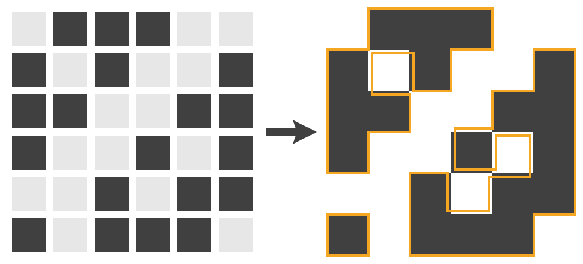

# Bitmap Outliner

This algorithm converts a bitmap image to vector paths enclosing the pixel groups.



*The outlined paths on the right side are slightly shifted to show their way around the pixels; they will, of course, be aligned with the pixel borders.*

## SVG Paths

Given the following bitmap from the above image:

```c
0, 1, 1, 1, 0, 0,
1, 0, 1, 0, 0, 1,
1, 1, 0, 0, 1, 1,
1, 0, 0, 1, 0, 1,
0, 0, 1, 0, 1, 1,
1, 0, 1, 1, 1, 0,
```

The generated SVG path will look like this (line breaks are added to separate the path loops):

```xml
<svg viewBox="0 0 6 6" xmlns="http://www.w3.org/2000/svg">
	<path d="
		M 1 0h3v1h-1v1h-1v-1h-1v1h1v1h-1v1h-1v-3h1z
		M 5 1h1v4h-1v1h-3v-2h1v1h1v-1h1v-1h-1v1h-1v-1h1v-1h1z
		M 0 5h1v1h-1z"
		fill="#000" fill-rule="evenodd"/>
</svg>
```

## C Example

```c
#include <stdio.h>
#include "bitmap-outliner.h"

// the bitmap size
int const width = 6;
int const height = 6;

// the bitmap data
uint8_t const data[] = {
	0, 1, 1, 1 ,0, 0,
	1, 0, 1, 0 ,0, 1,
	1, 1, 0, 0 ,1, 1,
	1, 0, 0, 1 ,0, 1,
	0, 0, 1, 0 ,1, 1,
	1, 0, 1, 1 ,1, 0,
};

int main() {
	// allocate outliner
	bmol_outliner* outliner = bmol_alloc(width, height, data);
	
	// find paths in bitmap
	bmol_find_paths(outliner, NULL);
	
	// calculate SVG path length (needs some performance).
	// for numerous calls to `bmol_svg_path`,
	// better use a large enough buffer directly.
	size_t path_len = bmol_svg_path_len(outliner);
	
	// ok for small bitmaps; be aware to not use large buffers on the stack!
	char path[path_len];
	
	// write SVG path to `path`
	bmol_svg_path(outliner, path, path_len);
	
	// output SVG
	printf(
		"<svg viewBox=\"0 0 %d %d\" xmlns=\"http://www.w3.org/2000/svg\">\n"
		"	<path d=\"%s\" fill=\"#000\" fill-rule=\"evenodd\"/>\n"
		"</svg>\n", width, height, path);
	
	// free outliner
	bmol_free(outliner);
	
	return 0;
}
```

### Run

Execute the following command to run `main.c`:

```sh
$ sh main.c
```

## Javascript Example

```js
import 'src/bitmap-outliner';

// the bitmap size
const width = 6;
const height = 6;

// data can be any indexable array
const data = new Uint8Array([
	0, 1, 1, 1 ,0, 0,
	1, 0, 1, 0 ,0, 1,
	1, 1, 0, 0 ,1, 1,
	1, 0, 0, 1 ,0, 1,
	0, 0, 1, 0 ,1, 1,
	1, 0, 1, 1 ,1, 0,
]);

// create outliner
let outliner = new BitmapOutliner(width, height, data);

// get SVG path; implicitly calls `outliner.findPaths()`
let path = outliner.svgPath();

// output SVG
console.log(
`<svg viewBox="0 0 ${width} ${height}" xmlns="http://www.w3.org/2000/svg">
	<path d="${path}" fill="#000" fill-rule="evenodd"/>
</svg>`);
```